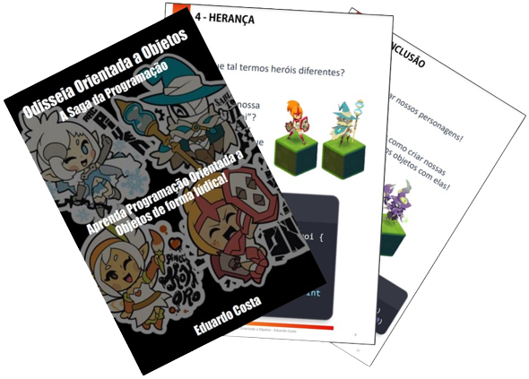

# Projeto EBOOK Gerado por I.A.s

> ℹ️ **NOTE:** Este é o repositório desenvolvido durante o curso na plataforma da [DIO](https://dio.me)

Projeto com o objetivo de gerar um ebook digital com as facilidades das ferramentas de IA. todos os prompts
seguem abaixo.

## 💻 Tecnologias utilizadas no projeto

- [ChatGPT](https://chat.openai.com/)
- [Removebg](https://www.remove.bg/pt-br)
- [PowerPoint](https://www.microsoft.com/en/microsoft-365/powerpoint)

## 🧠 Prompts

ChatGPT：

|  Ação  | prompt                                                                                                                                                                               |
| :----: | ------------------------------------------------------------------------------------------------------------------------------------------------------------------------------------ |
| Título | Crie um título de um ebook sobre o tema de Programação Orientada à objetos, o título deve ser épico e curto, e tenha uma temática de RPG no título, me liste 5 variações de títulos. |

### conteúdo

Me dê um breve texto sobre cada pilar de POO  
REGRAS:

- Explique sempre de uma maneira simples
- Deixe o texto enxuto
- Sempre traga exemplos de código em contextos reais
- Sempre deixe um título sugestivo por tópico
- Faça um paralelo com um RPG quando possível
- Como se fosse um jogo
- Códigos em Swift |

## ✨ Features

- Conteúdo gerado via ChatGPT adaptado por mim
- Imagens pertencentes à Ankama Games

## 🛠️ Instruções de execução

Utilize os prompts acima nas ferramentas sugeridas para gerar o material base e utilize uma ferramenta de edição de documentos como power point, libreoffice , indesign para diagramação.

_Aula feita seguindo orientações do professor:_

## 👨‍💻 Expert

    
    
&nbsp&nbsp&nbspFelipe Aguiar 
    &nbsp&nbsp&nbsp
    <a href="https://github.com/felipeAguiarCode">
    GitHub</a>&nbsp;|&nbsp;
    <a href="www.linkedin.com/in/
felipe-exe">LinkedIn</a>
&nbsp;|&nbsp;
    <a href="https://www.instagram.com/felipeaguiar.exe/">
    Instagram</a>
&nbsp;|&nbsp;

  

